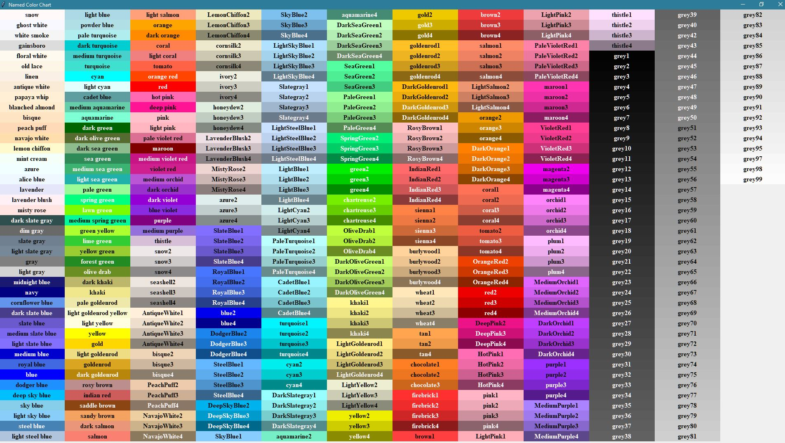

<!--
_color: white
-->

#
# Hello, world !!

---

<!--
_color: tomato
_backgroundColor: azure
-->

# " VSCode " と " Marp " を使って
# 簡易的な " スライド " を作成する🥳

---

<!-- 
_backgroundColor: springgreen
-->

# あらかじめ下準備として…
##
## " VSCode " に 拡張機能" Marp " をインストールするだけ

---

<!--
_color: slateblue
-->

### スフィンクスに化けたつもりが
### 思うようにならず
## 途方に暮れるリラックマ🐻

---

<!--
_backgroundColor: khaki
-->

#### JR児島駅
#### 駅前にあるのは…
#
#### なぜか
## ヤマダ電機 😱

---

<!-- 
_header: " 資料：カラーチャート(カラー指定できるが、末尾の数字がついているカラーには非対応😊)" 
-->

---

# 参考サイト
- " Marp " の公式サイト : https://marpit.marp.app/
- " Quita " の参考記事 : 
https://qiita.com/tomo_makes/items/aafae4021986553ae1d8  https://qiita.com/YoshikiIto/items/74b3d786266b1de3ed93
- その他の参考記事：
https://presenuniv.com/marp-web-editor-for-easy-presentation-creation-tips-for-captivating-slides-with-markdown/#toc10

  https://note.com/robothink/n/nb7e07f213948
  https://note.com/kabechiyo13/n/nc20d0b6608bb

---

<!--
_footer: " @ だらっくま "
-->

